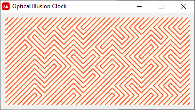
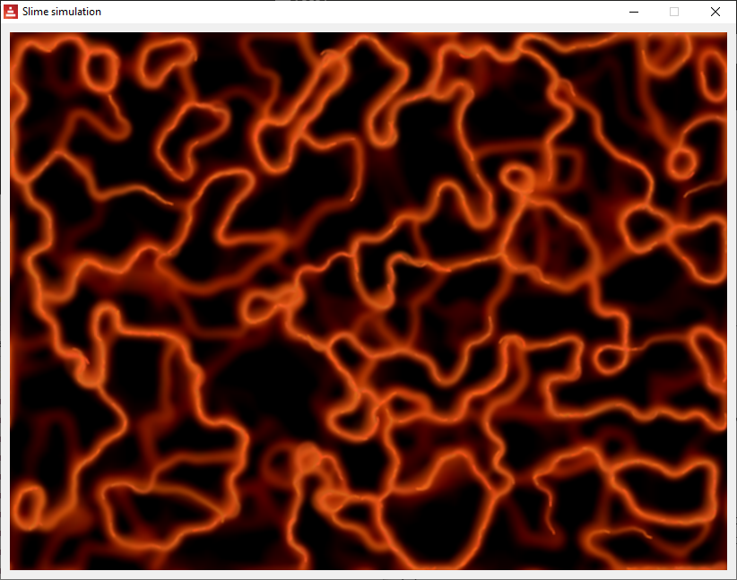
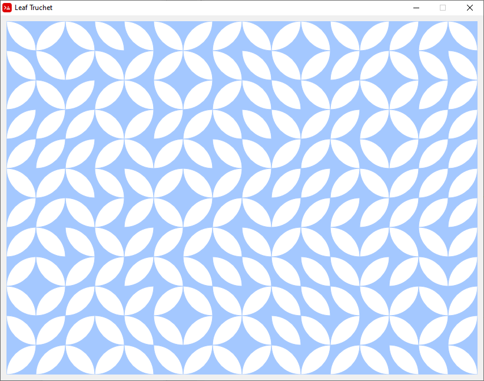
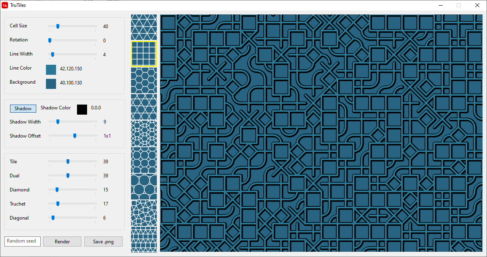

# Graphics-Red
Graphics/visualization with Red

L-systems
-

L-systems.red is a tool for exploring the world of L-systems, inspired by http://www.kevs3d.co.uk/dev/lsystems/#

Most examples are taken from "Lindenmayer Systems, Fractals, and Plants", available at http://algorithmicbotany.org/papers/lsfp.pdf

Extended Filled Truchet tiles
-
Simple tiling of the plane with 2 sets of Truchet tiles, each set consisting of 3 tiles.

Optical illusion clock
-
A software cover of a [TokyoFlash watch](https://tokyoflash.com/collections/watches/products/optical-illusion-lcd-watch)

Langton's ant
-
A little project demonstrating the [Langton's ant](https://en.wikipedia.org/wiki/Langton%27s_ant) (a two-dimensional universal Turing machine)

Slime mold simulation
-
Inspired by the work of Sebastian Lague

Leaf-shaped Truchet tiles
-
A simple variation of simple Truchet tiles, where the diagonal lines are replaced by "leaves"

TruTiles
-
Pattern generator. it creates a grid of tiles (the 3 regular and another 6 semiregular tesselations og the plane) and renders each tile with a mix of 5 styles: 
- Tile: the outline of the tile
- Dual: lines from the centers of the edges to the center of the tile
- Diamond: lines connecting the centers of the edges
- Truchet: arcs connecting the edges two by two
- Diagonals: lines connecting the vertices of the tile and the center of the tile

