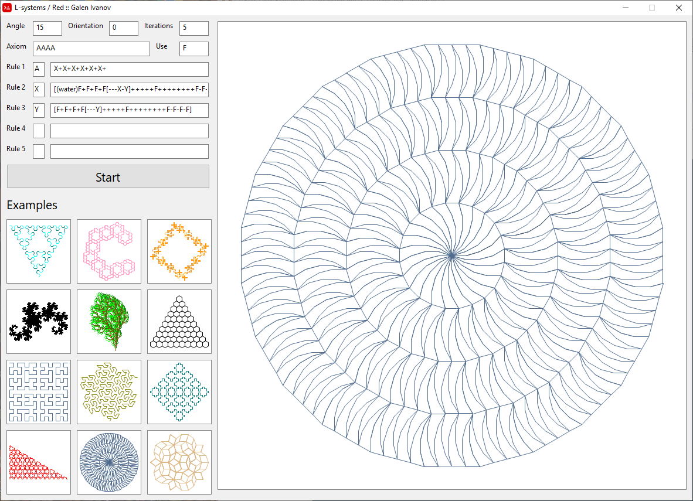
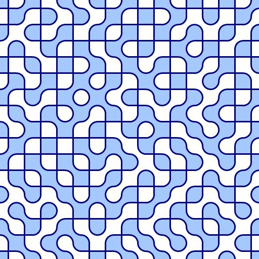

# Graphics-Red
Graphics/visualization with Red

L-systems
-

L-systems.red is a tool for exploring the world of L-systems, inspired by http://www.kevs3d.co.uk/dev/lsystems/#

Most examples are taken from "Lindenmayer Systems, Fractals, and Plants", available at http://algorithmicbotany.org/papers/lsfp.pdf

Extended Filled Truchet tiles
-
Simple tiling of the plane with 2 sets of Truchet tiles, each set consisting of 3 tiles.

Optical illusion clock
-
A software cover of a [TokyoFlash watch] (https://tokyoflash.com/collections/watches/products/optical-illusion-lcd-watch)

